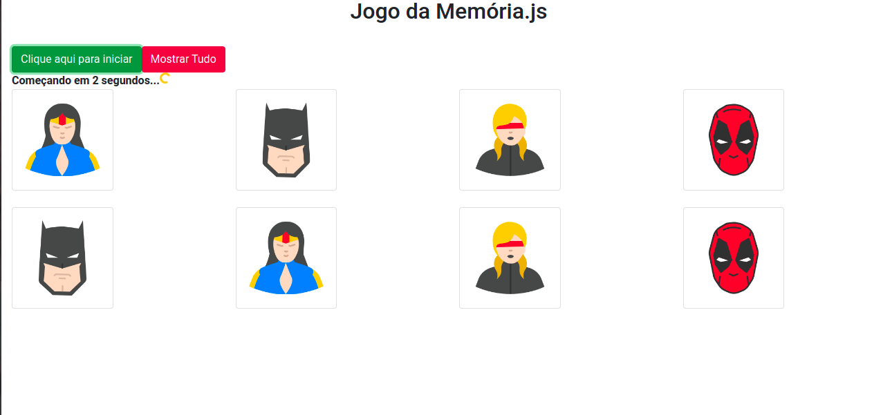

## Memory Game in JS
 

Esse projeto foi desenvolvido utilizando Javascript na web.
Trata-se de um jogo da memória aonde o objetivo é conseguir lembrar de todas as combinações sem errar.

você pode testar aqui no seu browser pelo link:
https://isaacwrk.github.io/memorygamejs/

Fico aberto a novas implementações caso queiram ajudar!
